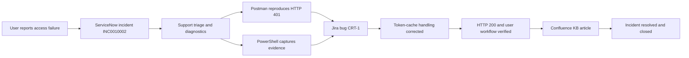

# Enterprise IT Operations Simulation

An end-to-end application support case study that follows a production-style authentication incident from initial intake through investigation, engineering escalation, knowledge capture, verification, and closure.

The simulated incident concerns users receiving **HTTP 401 Unauthorized** responses from an inventory application after resetting their Microsoft Entra ID password. The project demonstrates how ServiceNow, Jira, Confluence, Postman, PowerShell, and operational documentation work together during an enterprise support workflow.

## Scenario

Users can complete identity-provider authentication, but requests to the Inventory Management API are rejected. The support workflow records the incident in ServiceNow, escalates application-side investigation through Jira, reproduces the failure with an API test collection, gathers diagnostic evidence with PowerShell, documents the resolution in Confluence, and closes the incident after verification.

## Workflow



## What this project demonstrates

- ITIL-aligned incident intake, triage, escalation, resolution, and closure
- ServiceNow incident handling and customer-visible communication
- Jira bug tracking, prioritization, labels, and engineering handoff
- Confluence knowledge-base documentation and reusable support guidance
- REST API troubleshooting with Postman and HTTP status-code analysis
- PowerShell-based connectivity, DNS, TLS, endpoint, and log diagnostics
- Root-cause analysis, runbook development, and evidence-based verification

## Incident summary

| Item | Value |
|---|---|
| ServiceNow incident | `INC0010002` |
| Jira issue | `CRT-1` |
| Priority | Medium |
| Affected service | Inventory Management application |
| Symptom | HTTP 401 after password reset |
| Simulated root cause | Stale application-side session/token cache after credential change |
| Resolution | Invalidate stale session state, obtain a fresh token, and verify API access |
| Validation | Health endpoint reachable; authenticated API request returns HTTP 200 |

## Repository structure

```text
.
├── confluence/       # Knowledge article in portable Markdown
├── diagrams/         # Architecture and incident-flow diagram
├── docs/             # Incident report, RCA, runbook, and architecture notes
├── jira/             # Engineering escalation record
├── postman/          # Importable collection and local mock environment
├── powershell/       # Diagnostic automation
├── screenshots/      # Numbered workflow evidence
├── servicenow/       # Incident record and update history
└── README.md
```

## Run the technical simulation

The Postman collection uses a public echo endpoint so that no live Contoso system or credential is required. Import both files below into Postman:

1. `postman/Inventory-API-Support-Tests.postman_collection.json`
2. `postman/Local-Simulation.postman_environment.json`

Run the collection to demonstrate:

- health-check validation;
- a simulated unauthorized response;
- a simulated successful response after remediation;
- response-time and status-code assertions.

Run the PowerShell diagnostic script from PowerShell 7 or Windows PowerShell:

```powershell
./powershell/Invoke-InventoryApiDiagnostics.ps1 \
  -ApiBaseUrl "https://postman-echo.com" \
  -OutputDirectory "./diagnostic-output"
```

The script creates timestamped JSON and text evidence without printing or storing authentication secrets.

## Documentation

- [Incident report](docs/incident-report.md)
- [Root-cause analysis](docs/root-cause-analysis.md)
- [Support runbook](docs/runbook.md)
- [Architecture notes](docs/architecture.md)
- [ServiceNow record](servicenow/INC0010002.md)
- [Jira escalation](jira/CRT-1.md)
- [Knowledge article](confluence/KB-001-http-401-after-password-reset.md)

## Evidence gallery

| Stage | Evidence |
|---|---|
| ServiceNow incident |  |
| Jira escalation |  |
| Confluence knowledge article |  |

Additional screenshots and descriptions are listed in [`screenshots/README.md`](screenshots/README.md).

## Scope and safety

This is a portfolio simulation. It does not contain production credentials, customer data, private API endpoints, or claims of operating a live Contoso environment. Microsoft Entra ID is the current product name; screenshots retain the familiar “Azure AD” wording used in the simulated ticket.

## License

Released under the [MIT License](LICENSE).
