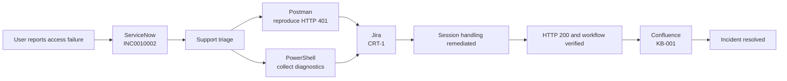
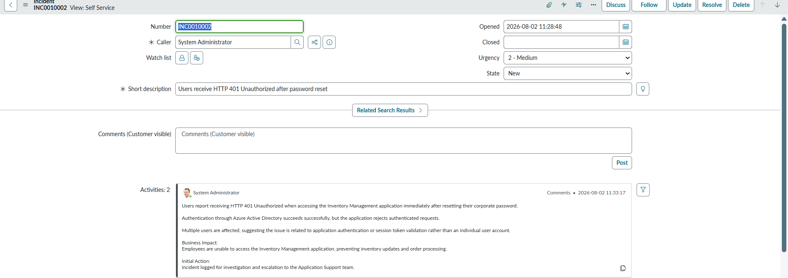
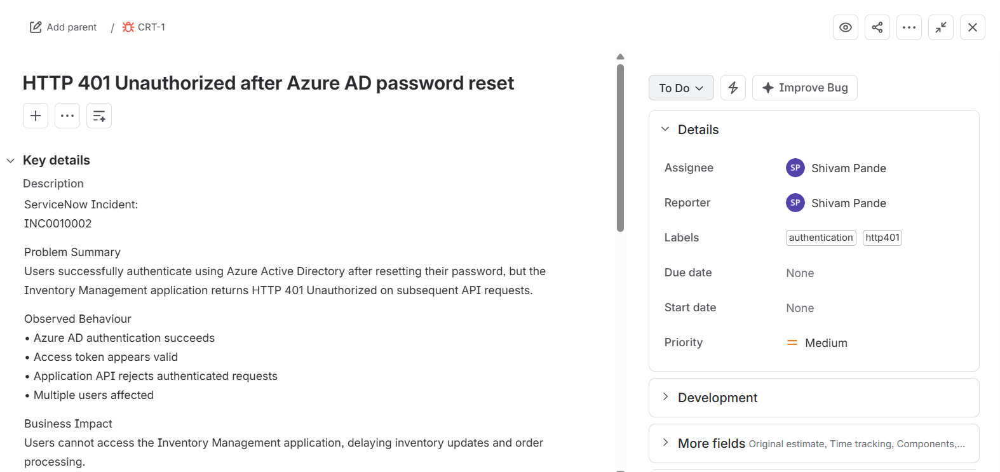
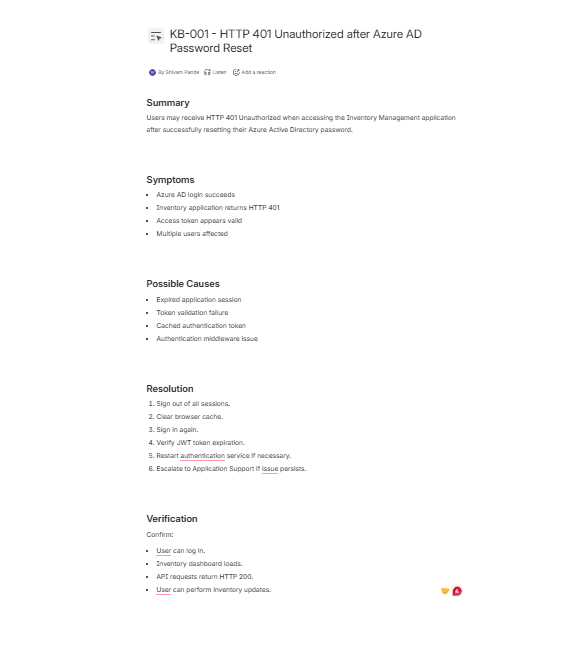
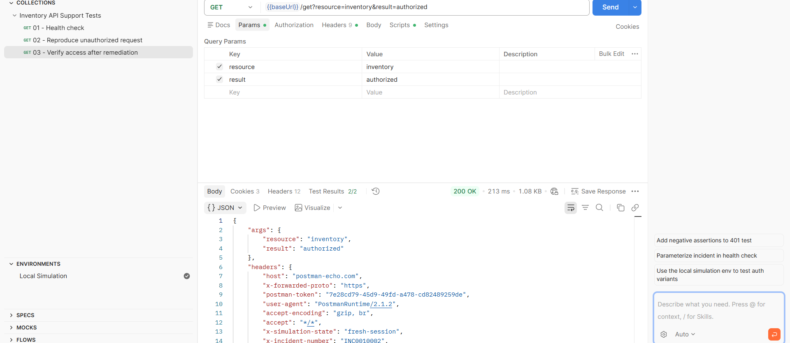

# Enterprise IT Operations Simulation

[](#scope-and-safety)
[](#support-workflow)
[](#technical-simulation)

An end-to-end application-support case study that follows a production-style authentication incident from intake and triage through engineering escalation, remediation, verification, knowledge capture, and closure.

The scenario models employees receiving **HTTP 401 Unauthorized** responses from an Inventory Management application after resetting their Microsoft Entra ID passwords. It demonstrates how an enterprise support team can coordinate ServiceNow, Jira, Confluence, Postman, PowerShell, and structured operational documentation around one traceable incident.

> **Portfolio scope:** This repository is a controlled simulation. It uses demo SaaS instances and the public Postman Echo service; no production credentials, customer information, or private endpoints are included.

## Project highlights

- Created and documented a ServiceNow incident with business impact, investigation notes, escalation references, and resolution details.
- Escalated the defect to Jira with evidence, an engineering hypothesis, acceptance criteria, and a simulated remediation.
- Published reusable troubleshooting guidance as a Confluence knowledge article.
- Built an importable Postman collection that validates healthy, unauthorized, and remediated API paths.
- Automated DNS, TCP, and HTTP diagnostics with PowerShell and timestamped evidence output.
- Produced an incident report, root-cause analysis, support runbook, architecture notes, and a numbered evidence gallery.

## Incident summary

| Item | Value |
|---|---|
| ServiceNow incident | `INC0010002` |
| Jira issue | `CRT-1` |
| Knowledge article | `KB-001` |
| Priority | Medium |
| Affected service | Inventory Management application |
| Symptom | HTTP 401 after password reset |
| Simulated root cause | Stale application-side session metadata after a credential change |
| Remediation | Invalidate stale session state and establish a new session with a fresh token |
| Validation | Health route returns HTTP 200; unauthorized route remains HTTP 401; remediated route returns HTTP 200 |

## Support workflow



See the [architecture and support boundaries](docs/architecture.md) for the request path, tooling boundaries, and simulated failure domain.

## Technical simulation

### Postman

Import these two files:

1. [`postman/Inventory-API-Support-Tests.postman_collection.json`](postman/Inventory-API-Support-Tests.postman_collection.json)
2. [`postman/Local-Simulation.postman_environment.json`](postman/Local-Simulation.postman_environment.json)

Select the **Local Simulation** environment and run the collection. It contains three safe requests:

| Request | Expected result | Purpose |
|---|---:|---|
| Health check | HTTP 200 | Confirm endpoint reachability and response time |
| Reproduce unauthorized request | HTTP 401 | Demonstrate the incident symptom without a real token |
| Verify access after remediation | HTTP 200 | Confirm the simulated recovery path |

Detailed instructions are in [`postman/README.md`](postman/README.md).

### PowerShell

Run from the repository root in Windows PowerShell 5.1+ or PowerShell 7+:

```powershell
./powershell/Invoke-InventoryApiDiagnostics.ps1 `
  -ApiBaseUrl "https://postman-echo.com" `
  -OutputDirectory "./diagnostic-output"
```

The script checks DNS resolution, TCP connectivity, and HTTP reachability, then writes timestamped JSON and text reports. It does not request, print, or persist authentication secrets.

Detailed usage and exit codes are in [`powershell/README.md`](powershell/README.md).

## Repository structure

```text
.
├── confluence/       # Portable copy of the knowledge article
├── diagrams/         # Architecture and workflow diagram
├── docs/             # Incident report, RCA, runbook, architecture, validation
├── jira/             # Engineering escalation record
├── postman/          # Importable collection and environment
├── powershell/       # Diagnostic script and sanitized sample output
├── screenshots/      # Numbered implementation evidence
├── servicenow/       # Incident record and work-note timeline
├── LICENSE
└── README.md
```

## Documentation

| Artifact | Purpose |
|---|---|
| [Incident report](docs/incident-report.md) | Impact, timeline, resolution, and follow-up actions |
| [Root-cause analysis](docs/root-cause-analysis.md) | Five whys, contributing factors, and corrective actions |
| [Support runbook](docs/runbook.md) | Repeatable first-line investigation and escalation procedure |
| [Architecture notes](docs/architecture.md) | Request path, support-tool boundaries, and failure domain |
| [Validation report](docs/validation.md) | Repository checks and evidence-to-artifact traceability |
| [ServiceNow record](servicenow/INC0010002.md) | Incident fields, customer description, work notes, and closure |
| [Jira escalation](jira/CRT-1.md) | Engineering handoff, hypothesis, and acceptance criteria |
| [Confluence article](confluence/KB-001-http-401-after-password-reset.md) | Reusable support knowledge for similar incidents |

## Evidence gallery

| ServiceNow | Jira |
|---|---|
|  |  |

| Confluence | Technical verification |
|---|---|
|  |  |

All ten screenshots are indexed in [`screenshots/README.md`](screenshots/README.md).

## Skills demonstrated

`ServiceNow` · `Jira` · `Confluence` · `ITIL incident management` · `REST API troubleshooting` · `Postman` · `PowerShell` · `HTTP status analysis` · `DNS/TCP diagnostics` · `root-cause analysis` · `runbook development` · `knowledge management`

## Scope and safety

- All organizations, users, services, and remediation actions are simulated.
- The public Postman Echo API is used only to reproduce deterministic HTTP status paths.
- No access token, password, private API URL, customer record, or production log is stored.
- Screenshots may retain platform demo data and the historical “Azure AD” wording used in the simulated ticket; current documentation uses **Microsoft Entra ID**.
- The project demonstrates process and troubleshooting methodology rather than claiming operation of a live enterprise environment.

## License

Released under the [MIT License](LICENSE).
