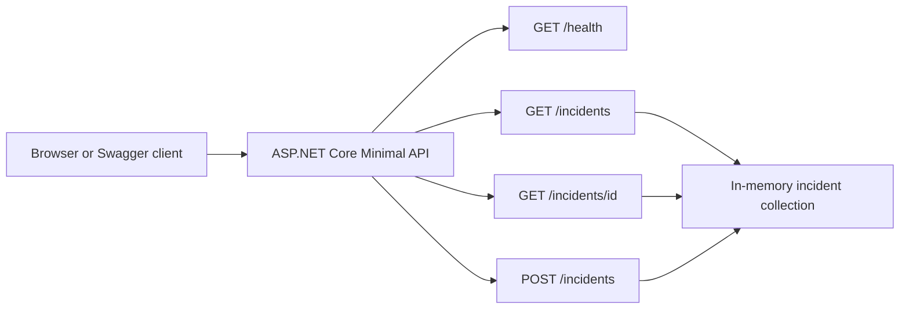

# Architecture and Support Boundaries

The simulation models a browser or API client authenticating through Microsoft Entra ID and then calling an Inventory Management API. ServiceNow records customer impact, Jira tracks engineering changes, Confluence preserves reusable support knowledge, and technical tools reproduce and validate the application behavior.

## Request path

1. The user authenticates with Microsoft Entra ID.
2. The client receives an access token.
3. The client calls the Inventory Management API over HTTPS.
4. Authentication middleware validates token and session metadata.
5. The API accesses the inventory data store when authorization succeeds.

## Support path

1. ServiceNow captures the user report and business impact.
2. PowerShell validates DNS, TCP, TLS, and endpoint reachability.
3. Postman reproduces the HTTP response and verifies remediation.
4. Jira tracks the application defect and acceptance criteria.
5. Confluence stores the knowledge article and first-line response steps.

## ASP.NET Core demonstration component

The local `IT.Operations.Api` project is a separate supporting component used to demonstrate foundational C# and REST API development. It exposes health and incident-management endpoints, returns JSON over HTTP, and publishes its contract through Swagger/OpenAPI.

The API is intentionally local and in memory. It does not replace or claim integration with the demo ServiceNow, Jira, or Confluence environments.

## Failure boundary

Because identity sign-in succeeds and health checks remain available, the simulated authentication failure boundary is between application authentication middleware and its distributed session cache—not the identity provider, DNS, or network path.

## Environment boundaries

- **Demo SaaS tools:** ServiceNow, Jira, and Confluence are used for workflow evidence.
- **Public test service:** Postman Echo provides deterministic HTTP responses for safe troubleshooting exercises.
- **Local component:** The ASP.NET Core API runs on localhost and contains only sample in-memory data.
- **Documentation layer:** Markdown records preserve the scenario independently of third-party demo environments.
