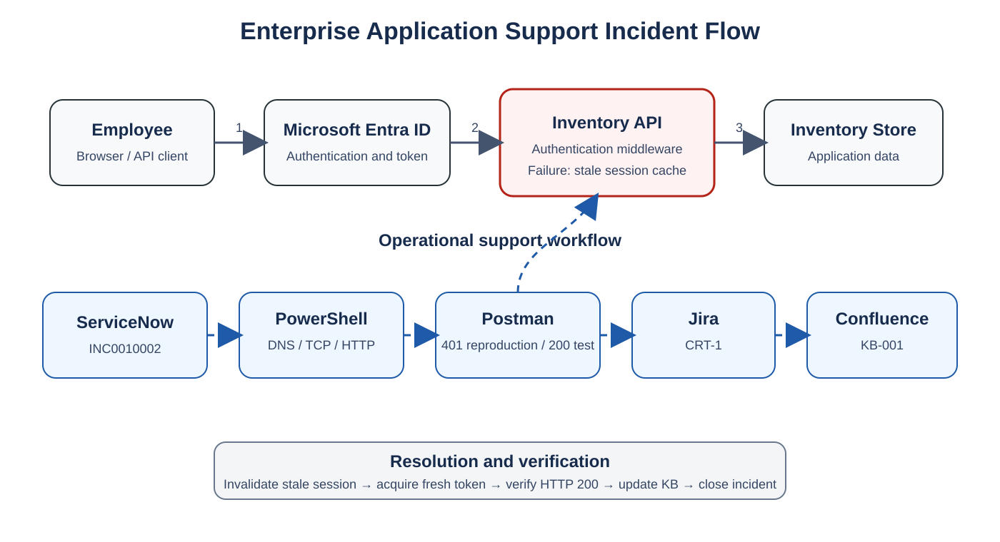

# Architecture and Support Boundaries

The simulation models a browser or API client authenticating through Microsoft Entra ID and then calling an Inventory Management API. ServiceNow records customer impact, Jira tracks engineering changes, and Confluence preserves reusable support knowledge.

## Request path

1. The user authenticates with Microsoft Entra ID.
2. The client receives an access token.
3. The client calls the Inventory Management API over HTTPS.
4. Authentication middleware validates token and session metadata.
5. The API accesses the inventory data store when authorization succeeds.

## Support path

1. ServiceNow captures the user report and impact.
2. PowerShell validates DNS, TCP, TLS, and endpoint reachability.
3. Postman reproduces the HTTP response and verifies remediation.
4. Jira tracks the application defect and acceptance criteria.
5. Confluence stores the knowledge article and first-line response steps.

## Failure boundary

Because identity sign-in succeeds and health checks remain available, the simulated failure boundary is between application authentication middleware and its distributed session cache—not the identity provider, DNS, or network path.
